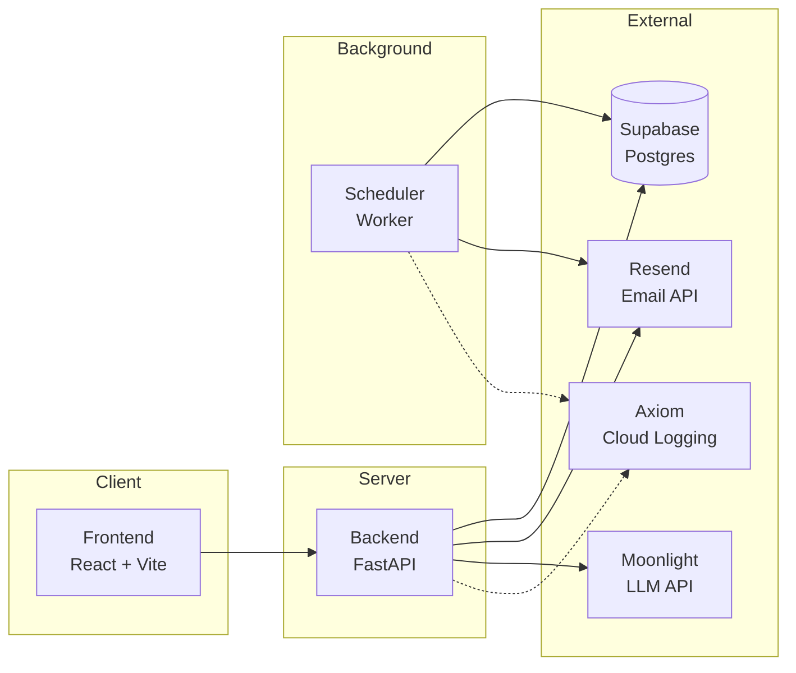

# Everis - AI Mail Personalization

A Mini-SaaS application that helps Sales Development Reps (SDRs) automate personalized email outreach at scale.

## Overview

This application enables users to:
- **Import Leads** – Upload CSV files with structured headers:
  - Required: `email`, `first_name`, `last_name`, `company`, `title`
  - Optional: `linkedin_url`, `industry`, `notes` (for personalization context)
- **AI-Powered Personalization** – Generate human-like, relevant emails using LLMs based on lead data
- **Automated Follow-ups** – Schedule and send follow-up emails based on configurable wait periods
- **Reply Tracking** – Mark leads as replied (simulated button or webhook-based)

## Design Principles

- Ship a polished core before adding features
- Prefer boring, reliable infrastructure
- Optimize for demoability and clarity
- Avoid background magic that’s hard to explain

## Tech Stack

| Layer | Technology | Purpose |
|-------|------------|---------|
| Frontend | React + Vite + TypeScript | UI with shadcn/ui components |
| Styling | Tailwind CSS | Utility-first CSS |
| Backend | Python (FastAPI) | REST API |
| Logging | Axiom | Cloud logging |
| Database | Supabase (Postgres) | Data persistence + real-time |
| Email | Resend | Transactional email delivery |
| LLM | OpenAI-compatible LLM | AI-powered email personalization |

## Architecture



### Scheduling Strategy
- A lightweight background worker polls the database every minute
- Queries for pending follow-ups where `scheduled_at <= NOW()` and `has_replied = false`
- Sends all due emails in batch, updates status

### Reply Detection
- **MVP**: Simulated reply button in UI marks lead as replied
- **Stretch**: Resend inbound webhooks for real reply detection

## Project Structure

```
├── backend/       # Python FastAPI backend
├── frontend/      # React + Vite frontend
└── README.md
```

## Getting Started

*Setup documentation coming soon*