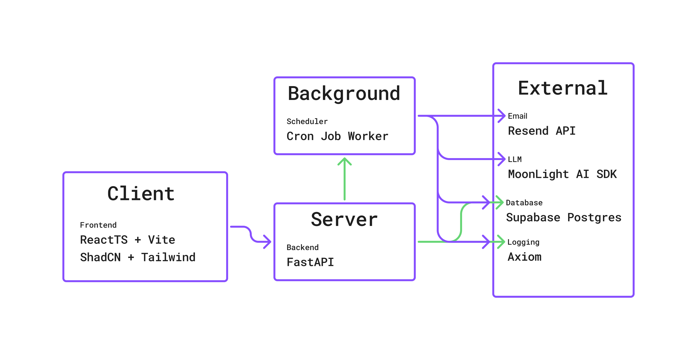

# Everis - AI Mail Personalization

> Mini-SaaS for automated, AI-powered email outreach

## Features

- **Campaign Management** – Create and manage email outreach campaigns
- **AI Personalization** – Generate human-like emails using LLMs
- **Lead Import** – CSV upload with structured lead data
- **Auto Follow-ups** – Configurable follow-up sequences
- **Reply Tracking** – Track engagement and replies

## Tech Stack

| Layer | Technology | Purpose |
|-------|------------|---------|
| Frontend | React + Vite + TypeScript | UI with shadcn/ui components |
| Styling | Tailwind CSS | Utility-first CSS |
| Backend | Python (FastAPI) | REST API |
| Database | Supabase (Postgres) | Data persistence + real-time |
| Email | Resend | Transactional email delivery |
| LLM | OpenAI-compatible LLM | AI-powered email personalization |

## Quick Start

```bash
# Backend
cd backend

python -m venv venv
venv\Scripts\activate # Windows. For Linux: source venv/bin/activate
pip install -r requirements.txt

uvicorn app:app --reload
```

```bash
# Frontend
cd frontend
npm install
npm run dev
```

## Project Structure

```
├── backend/
│   ├── app.py              # FastAPI entry point
│   └── src/
│       ├── api/            # Route handlers
│       ├── db/             # Database schema & queries
│       ├── mail/           # Email generation & sending
│       └── logger.py       # Axiom logging
├── frontend/
│   └── src/
│       ├── components/     # UI components (shadcn)
│       ├── pages/          # Route pages
│       └── lib/            # Utilities & API client
└── README.md
```

## Environment Variables

Place a .env in backend folder with the following content:

```env
RESEND_API_KEY = ...

OPENROUTER_API_KEY = ...
GROQ_API_KEY = ...

DATABASE_URI = ...

AXIOM_TOKEN = ...
AXIOM_DATASET = ...
```

## Architecture

